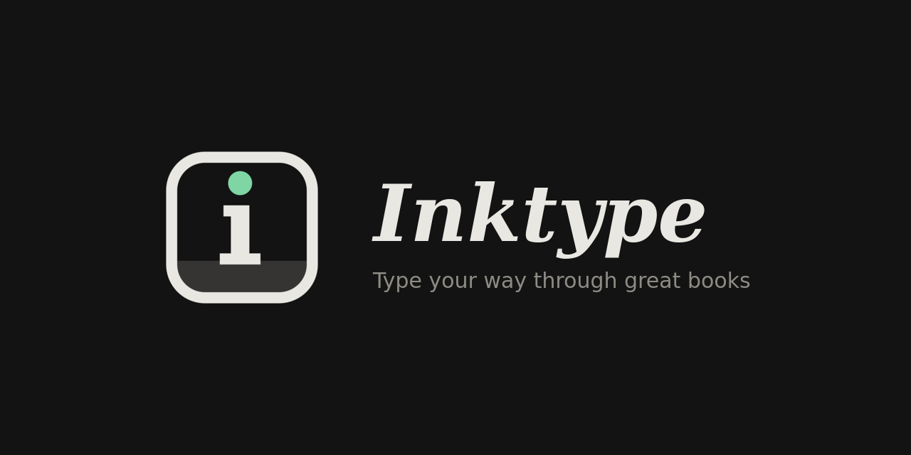
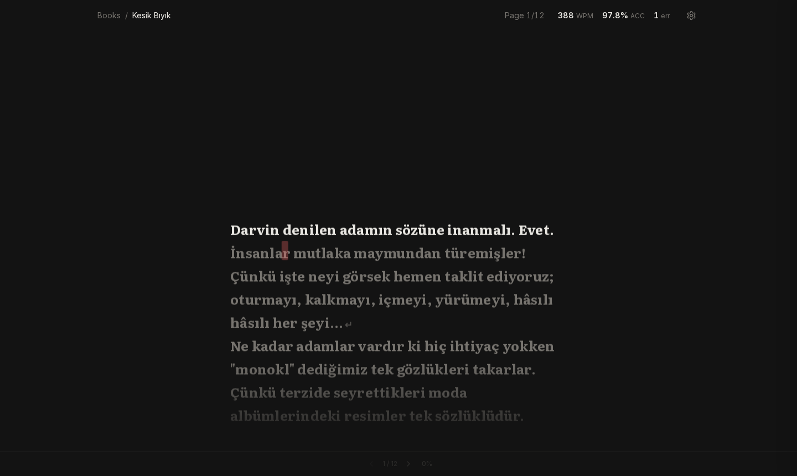
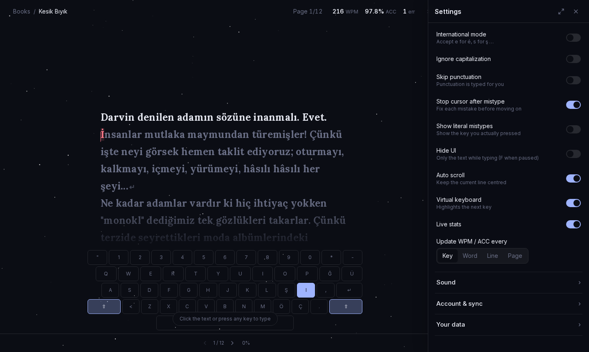
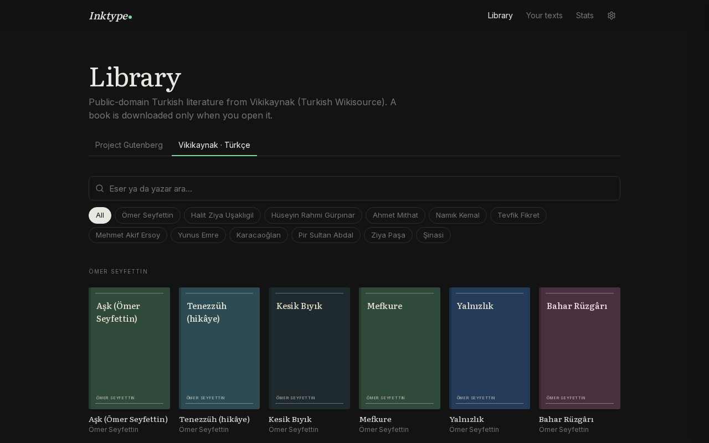
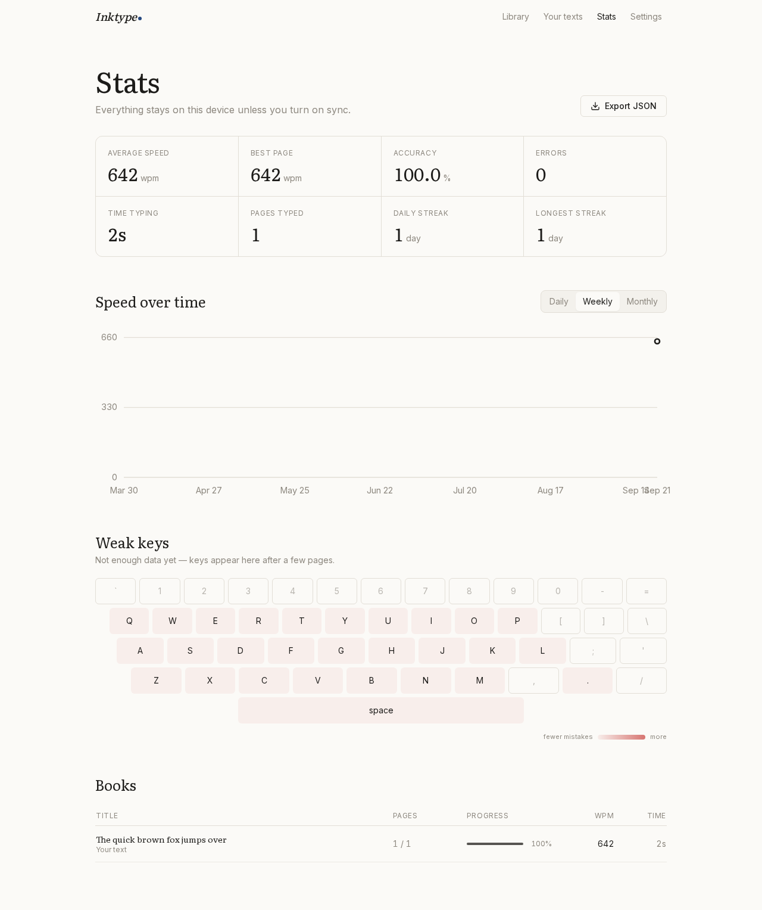

<p align="center">
  
</p>

# Inktype

**Type your way through the books you always meant to read.** · [Website](https://lunanoir21.github.io/inktype/)

[](https://github.com/lunanoir21/inktype/actions/workflows/ci.yml)
[](LICENSE)
[](#built-with-vibe-coding)

Inktype is a free, open-source typing practice app. Instead of random words, you type through real
books — any of the 70,000+ public-domain titles on [Project Gutenberg](https://www.gutenberg.org), thousands
of Turkish works on [Vikikaynak](https://tr.wikisource.org), life + 70 classics from
[Project Gutenberg Australia](https://gutenberg.net.au) — or any text you paste in, one quiet page at a
time.

No subscriptions. No paywalls. No locked features. No ads. No tracking. Ever.

---

## Screenshots

| Typing | Settings drawer | Library | Stats |
| ------ | --------------- | ------- | ----- |
|  |  |  |  |

## Features

**Typing engine**
- Character-by-character input with the current character highlighted and mistakes shown inline in red
- Two mistake modes: _must fix_ (the cursor waits for the right key) or _continue_ (fix later with Backspace)
- The current line stays vertically centered; pages advance automatically when finished
- Shortcuts: <kbd>Esc</kbd> pause · <kbd>Tab</kbd> restart page · <kbd>Ctrl</kbd>+<kbd>Enter</kbd> next page ·
  <kbd>F</kbd> (while paused) toggle focus mode · <kbd>Ctrl</kbd>+<kbd>Backspace</kbd> delete word
- Focus mode hides everything but the text while you type
- Works with touch keyboards, IME composition and dead keys; optional accent/case-insensitive matching
- Skip punctuation, show literal mistypes, reading mode (just read, ← → to turn pages), auto scroll,
  on-screen keyboard (US and Turkish Q), WPM/accuracy updated per key, word, line or page
- Idle time is not counted towards your speed

**Effects — all free**
- Typing effects: Typewriter, Embers, Glow, Crunch, Explode, Fireworks, Shatter, Sparkle, Burn, Shock,
  Float, Ink, Corrupt, Pixelate
- Cursor effects: Afterimage, Rainbow, Sand, Stardust, Bubbles, Lightning, Flame Trail, Fireflies, Petals
- Animated backgrounds: Night Sky, Snow, Aurora, Rain, Digital Rain, Underwater, Light Shafts,
  Candlelight, Hearth, CRT
- Nine cursor shapes: Box, E-Box, Line, Under, Dot, High, H-Under, H-Dot, None — with a smooth-gliding cursor
- Everything respects `prefers-reduced-motion`

**Library**
- Search all of Project Gutenberg by title or author; browse by genre and language
- Turkish literature from Vikikaynak (Turkish Wikisource): Ömer Seyfettin, Halit Ziya, Namık Kemal,
  Yunus Emre and more; multi-chapter works are joined automatically
- Search in any language: titles are resolved through Wikidata, so "Hayvan Çiftliği" finds
  *Animal Farm* and "Suç ve Ceza" finds *Crime and Punishment*
- Author profiles: type an author's name to see their portrait, life dates and Wikipedia summary,
  and every book of theirs across the libraries
- Books that are public domain under life + 70 years rules (Orwell, for example) come from
  Project Gutenberg Australia — check the copyright law of your country
- Books are fetched only when you open one — nothing is bulk-downloaded — then cached
- Real book covers, proxied and cached by your server (a typographic cover when a book has none)
- Fast: search results are cached and pre-warmed, the next page loads in the background, and a
  book's text starts downloading as soon as you hover it
- Front matter (publisher pages, tables of contents) is skipped; typographic quotes and dashes are
  normalized to keys you can actually type
- Books are split into ~350-character pages at sentence boundaries
- Resume exactly where you left off, even mid-page

**Stats**
- Live WPM, average WPM, accuracy, errors and time
- Per-book progress, daily streak, WPM chart (daily / weekly / monthly)
- Keyboard heatmap of your weakest keys
- Export (and import) everything as JSON

**Your own texts**
- Paste any text, save it locally, or import it from a web page URL

**Customization**
- Every effect, cursor and background previews live on its tile before you pick it
- Settings open in a drawer on the right: drag its edge to resize it, or expand it to full screen
  (<kbd>Ctrl</kbd>+<kbd>,</kbd> toggles it)
- Ten designed looks (Classic Dark, Night Sky, Ink & Paper, Candlelight, Terminal, Ocean, Plain Gray,
  Aurora, Newsprint, Forest) that set theme, font, cursor and background in one click
- 31 built-in themes, every one customisable, plus your own themes
- 38 fonts, all self-hosted — serif, sans, mono and display faces, including Atkinson Hyperlegible and
  OpenDyslexic — with size, line width and bold text
- Optional keypress and mistake sounds (synthesized; no audio files)

**Languages**
- The interface is available in English and Turkish (Türkçe); "Auto" follows your browser.
  Adding a language means adding one file of strings — see `apps/web/src/lib/i18n/messages.ts`.

**Everywhere**
- Progress is stored in your browser — no account needed
- Optional local account on your own server to sync between devices
- Installable PWA; books you've opened work offline
- Fully responsive, works on phones and tablets

## Quick start (development)

Requirements: Node.js 20+ and [pnpm](https://pnpm.io) 10+.

```bash
git clone https://github.com/lunanoir21/inktype.git
cd inktype
pnpm install
cp apps/web/.env.example apps/web/.env
pnpm db:migrate          # creates the SQLite database
pnpm dev                 # http://localhost:3000
```

Useful scripts (run from the repository root):

| Command | What it does |
| ------- | ------------ |
| `pnpm dev` | Start the dev server |
| `pnpm build` / `pnpm start` | Production build / server |
| `pnpm lint` | ESLint across the workspace |
| `pnpm typecheck` | TypeScript across the workspace |
| `pnpm test` | Unit tests (Vitest) |
| `pnpm test:e2e` | End-to-end tests (Playwright) |
| `pnpm db:migrate` | Create/apply a database migration in development |

## Self-hosting

Inktype runs as a single container with an SQLite database on a volume.

```bash
git clone https://github.com/lunanoir21/inktype.git
cd inktype
docker compose up -d
```

Open <http://localhost:3000>. Migrations run automatically on start-up.

### Configuration

Set these in your shell or in a `.env` file next to `docker-compose.yml`:

| Variable | Default | Description |
| -------- | ------- | ----------- |
| `INKTYPE_PORT` | `3000` | Host port to publish |
| `ALLOW_REGISTRATION` | `true` | Allow new accounts. Set to `false` after creating yours on a public server |
| `COOKIE_SECURE` | `false` | Set to `true` when served over HTTPS |
| `GUTENBERG_MIRROR` | `https://www.gutenberg.org` | Gutenberg site used for search and book downloads |

Turkish works are fetched from `tr.wikisource.org` through the MediaWiki API; no configuration is
needed.

Data (accounts, synced progress, cached book texts) lives in the `inktype-data` volume. Back it up
by copying `/data/inktype.db` out of the container:

```bash
docker compose cp inktype:/data/inktype.db ./inktype-backup.db
```

### Behind a reverse proxy

Inktype is a plain HTTP server on port 3000. Put it behind Caddy, nginx or Traefik for TLS and set
`COOKIE_SECURE=true`. Example `Caddyfile`:

```
typing.example.com {
  reverse_proxy localhost:3000
}
```

## How it works

```
inktype/
├── apps/web/              Next.js 14 app (App Router)
│   ├── src/app/           Pages and API routes
│   ├── src/components/    UI (typing surface, library, stats, settings)
│   ├── src/lib/           Client store, themes, sync, server helpers
│   ├── prisma/            SQLite schema and migrations
│   ├── public/sw.js       Service worker (offline support)
│   └── e2e/               Playwright tests
└── packages/core/         Framework-free logic, fully unit tested
    ├── engine.ts          Typing engine (pure state machine)
    ├── paginate.ts        Sentence-aware pagination
    ├── gutenberg.ts       Boilerplate and front-matter stripping
    ├── html.ts            HTML → text for URL imports
    ├── stats.ts           WPM, accuracy, streaks, time series, key stats
    └── data.ts            Data model, validation and sync merging
```

- **Privacy by design.** The browser only talks to your Inktype server. Book search and downloads
  are proxied through it; fonts are self-hosted at build time. There is no analytics code at all.
- **Local first.** Everything you do is one JSON document in `localStorage`. Sync, when enabled,
  merges that document with the server copy using a commutative merge, so devices converge.
- **The core is plain TypeScript.** The engine, paginator and statistics have no framework
  dependencies and can be reused elsewhere.

## Built with vibe coding

Inktype was built through **vibe coding**: the whole project — design, typing engine, library,
effects, translations, tests and this README — was written in conversation with an AI coding
assistant ([Claude Code](https://claude.com/claude-code)), guided by a human who described what they
wanted and reviewed every step. Every feature is covered by the automated test suite, and
contributions from people and their assistants alike are welcome.

## Contributing

Contributions are very welcome — see [CONTRIBUTING.md](CONTRIBUTING.md) for the workflow, code style
and project conventions.

## License

[MIT](LICENSE). Book texts come from Project Gutenberg and are in the public domain in the United
States; please check the laws of your country before redistributing them.
